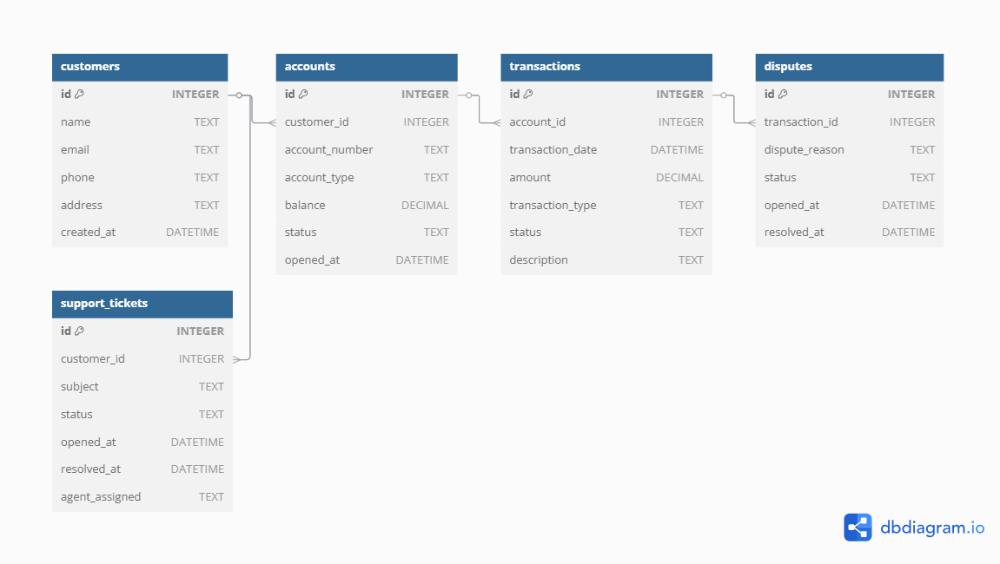

# Financial Support System (Mock Project)

This project simulates a financial support system using mock data and SQL scripts to demonstrate technical troubleshooting, data analysis, and database management skills.

It is designed as a **learning portfolio** to showcase hands-on experience with real-world datasets, SQL queries, and version control using Git and GitHub.

---

## 📁 Project Structure

| File / Folder                 | Description |
|------------------------------|-------------|
| `accounts.csv`               | Account information linked to customers |
| `customers.csv`              | Customer profile data |
| `transactions.csv`           | Mock transaction history across accounts |
| `disputes.csv`               | Disputes raised against transactions |
| `support_tickets.csv`        | Support tickets raised by customers |
| `missing-profile.sql`        | SQL query to identify customers with missing profile or contact data |
| `vip-customer-no-transactions.sql` | SQL to find VIP customers without any recorded transactions |


## 🧩 Entity Relationship Diagram


---

## 🧠 Use Case

This mock system is ideal for practicing:
- SQL data exploration and analysis
- Troubleshooting missing or incorrect records
- Building dashboards or reports using structured data
- Demonstrating your support/data skills 
---

## 💾 Tools Used

- SQLite (local database)
- DB Browser for SQLite (GUI for SQLite)
- Git & GitHub (version control & hosting)
- CSV (mock data format)

---

## 🚀 How to Use

1. Clone the repository:
   ```bash
   git clone https://github.com/Ravinavala/financial-support-system.git
